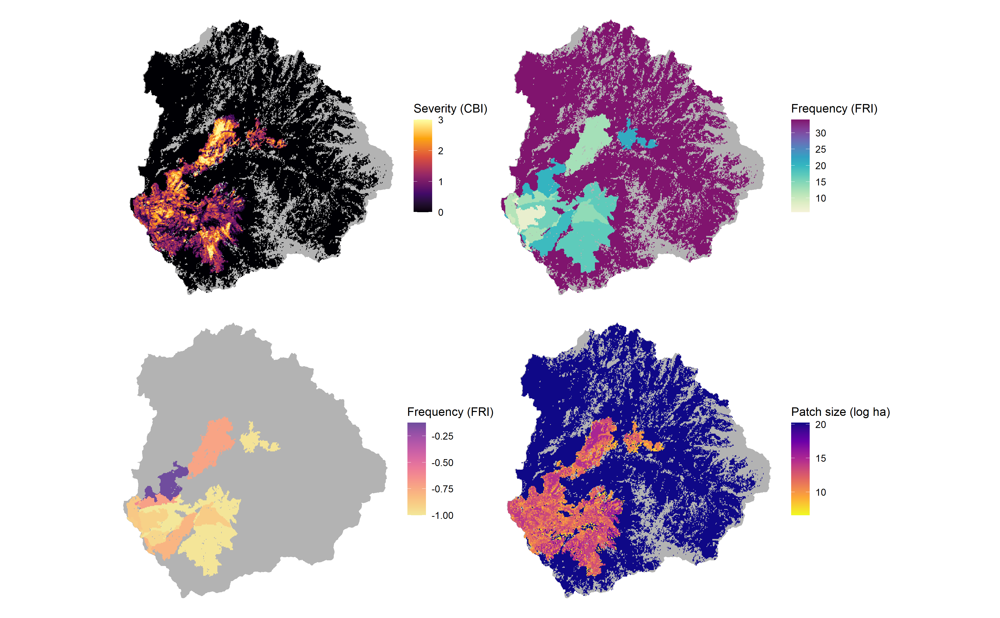

```{r setup, include = F}
knitr::opts_chunk$set(warning=FALSE, message=FALSE)
knitr::opts_knit$set(root.dir = "..")
```


# Quantifying Pyrodiversity  

Here I demonstrate the functionality of the [Pyrodiversity](https://github.com/zacksteel/pyrodiversity) repository, which is associated with the publication ["Quantifying pyrodiversity and its drivers"](https://doi.org/10.1098/rspb.2020.3202). I will limit calculations to the watersheds which intersect Yosemite National Park in California's Sierra Nevada Mountains and to moderate to large size fires (>404 ha) included in the Monitoring Trends in Burn Severity (MTBS) perimeters. I use the burn perimeters from MTBS but severity is calculated according to [Parks et al. 2019](https://www.mdpi.com/2072-4292/11/14/1735).   

All data for this demonstration are included in this repository, which can be cloned to run on your own. Alternatively, users can apply this code to their own fires and landscapes of interested. To do so you will need continuous composite burn index (CBI) rasters calculated using the Parks model or another validated burn severity model. 

There are three primary steps to calculating pyrodiversity: 1) Compile comprehensive fire histories for an area of interest. 2) Generate fire trait surfaces (rasters) using these fire history data. 3) Sample from fire trait surfaces to calculate pyrodiversity for points or areas of interest.  

## 1. Compile fire histories  

Estimates of burn severity (and subsequently patch size) are dependent on Landsat imagery, which first became available in 1984, as well as a validated severity model calibrated to the region of interest. We use the [Parks model](https://www.mdpi.com/2072-4292/11/14/1735) to estimate severity in forest of the western United States. Other regional models exist in areas with more limited spatial extent but more comprehensive histories. For example, the [Koontz model & dataset](https://osf.io/ke4qj/#!) includes California fires of at least 4 hectares that burned at least partially in mixed conifer forests.  

These fire history data must include a fire perimeter shapefile with ignition date (Julian day), ignition year, and unique fire ID, as well as fire severity rasters (currently limited to composite burn index) that can be associated with the perimeter shapefile using the fire ID.  

*Demo: There are 10 HUC10 watersheds (black outlines) whose centroids are within Yosemite (green polygon) and 64 fires (semi-transparent grey polygons) that intersect those watersheds between 1985 and 2018.*  


```{r}
library(tidyverse)
library(sf)
library(terra)
library(lwgeom)
library(FD)
library(colorspace)
library(knitr)
library(here)

## read in shapefiles
yose <- read_sf(here("data/spatial/yosemite.shp"))
hucs <- read_sf(here("data/spatial/yose_sheds.shp"))
yose_fires <- read_sf(here("data/spatial/yose_mtbs.shp")) 

ggplot() +
  geom_sf(data = yose, fill = "darkgreen", color = NA, alpha = 0.3) +
  geom_sf(data = hucs, fill = NA) +
  geom_sf(data = yose_fires, fill = "grey30", color = NA, alpha = 0.4) +
  theme_void()

as.data.frame(yose_fires) %>% 
  dplyr::select(Fire_ID, Fire_Name, Year, jday) %>% 
  head()
```

## 2. Generate fire trait surfaces  

Fire trait surfaces can be generated using the functions included in this repository, and allow a user to define trait weights and the importance decay rate of the "invisible mosaic" (i.e. how much less important are fires prior to the most recent).  

*Demo: for each watershed whose centroid is within Yosemite we will build fire trait surfaces for frequency, seasonality, severity and patch size of each watershed. Code below can be run for all (~2 hr run time) or you can skip this block and read in pre-calculated layers in step #3 below.*  


```{r eval = F}
## load functions
source(here("code/fri_surface.R"))
source(here("code/season_surface.R"))
source(here("code/sev_surface.R"))
source(here("code/patch_surface.R"))

library(tictoc)

tic()
## Frequency calculation (takes about 1 minute)
for (i in 1:nrow(hucs)) {
    ## pull out single landscape          
    huc <- hucs[i,]
    ## Setting up a path basename for this demo
    out_base <- paste0('fri_', huc$HUC10, '.tif')
    
    fri_surface(landscape = huc, #shapefile of landscape of interest
                fires = yose_fires, #shapefile containing fire IDs associated with severity rasters
                fire_years = "Year", # label of the fire year column
                start_year = 1984, # Year prior to start of dataset (severity data available starting 1985)
                end_year = 2018, # Year after end of dataset 
                decay_rate = 0.5, # Importance decay rate of the "invisible mosaic", between [0,1)
                out_raster = here('data', 'spatial','yose_fri', out_base)) #path for writing output rasters
}
toc()

tic()
## Seasonality calculation (takes about 40 seconds)
for (i in 1:nrow(hucs)) {
    ## pull out single landscape          
    huc <- hucs[i,]
    out_base <- paste0('sea_', huc$HUC10, '.tif')
    
    season_surface(landscape = huc, #shapefile of landsape of interest
                   fires = yose_fires, #shapefile containing fire IDs associated with severity rasters
                   fire_years = "Year", # label of the fire year column
                   fire_day = "jday",
                   decay_rate = 0.5, # Importance decay rate of the "invisible mosaic", between [0,1)
                   out_raster = here('data', 'spatial','yose_sea', out_base)) #path for writing output rasters
}
toc()


## Severity calculation (takes about 30 seconds)
tic()
for (i in 1:nrow(hucs)) {
    ## pull out single landscape          
    huc <- hucs[i,]
    out_base <- paste0('sev_', huc$HUC10, '.tif')
    
    sev_surface(landscape = huc, #shapefile of landsape of interest
                fires = yose_fires, #shapefile containing fire IDs associated with severity rasters
                severity_dir = here("data/spatial/yose_mtbs_sev"), # directory where fire rasters are held
                fire_years = "Year", # label of the fire year column
                decay_rate = 0.5, # Importance decay rate of the "invisible mosaic", between [0,1)
                out_raster = here('data', 'spatial','yose_sev', out_base)) #path for writing output rasters
}
toc()


## Patch calculation (takes about 1 minute)
tic()
for (i in 1:nrow(hucs)) {
    ## pull out single landscape          
    huc <- hucs[i,]
    out_base <- paste0('pat_', huc$HUC10, '.tif')
    
    patch_surface(landscape = huc, #shapefile of landsape of interest
                  fires = yose_fires, #shapefile containing fire IDs associated with severity rasters
                  severity_dir = here("data/spatial/yose_mtbs_sev"), # directory where fire rasters are held
                  fire_years = "Year", # label of the fire year column
                  decay_rate = 0.5, # Importance decay rate of the "invisible mosaic", between [0,1)
                  out_raster = here('data', 'spatial','yose_pat', out_base)) #path for writing output rasters
}
toc()

```


*For illustration, here is what the four surfaces look like for the Upper-Merced watershed, with non-vegetated areas masked out.*  

  


## 3 Calculate pyrodviersity from surfaces  

This can be done for a full landscape (e.g., a watershed) or buffered around sample points. Here I demonstrate this for watersheds and will add a sample point example at a later date.  

```{r, eval = F}

## Calculate pyrodviersity for each watershed
source(here("code/global_fd.R"))
## This block takes about an hour to run
pd <- lapply(1:nrow(hucs), function(i) {
  huc <- hucs[i,]
  id <- as.data.frame(huc)[1,"HUC10"]
  
  ## bring in trait rasters and adjust precision   
  ## E.g. Frequency - 1 year increments; Patch size - 1 log HA increments; 
  ## Severity - 0.5 CBI increments; Seasonality - 0.1 increments.
  mround <- function(x, base, digits){
        base*round(x/base, digits = digits)
      } 
  fri_r <- here(paste0("data/spatial/yose_fri/fri_", id, ".tif")) %>% 
    rast() %>% 
    round(digits = 0)
  sea_r <- here(paste0("data/spatial/yose_sea/sea_", id, ".tif")) %>% 
    rast() %>% 
    round(digits = 1)
  sev_r <- here(paste0("data/spatial/yose_sev/sev_", id, ".tif")) %>% 
    rast() %>% 
    mround(base = 5, digits = 1)
  pat_r <- here(paste0("data/spatial/yose_pat/pat_", id, ".tif")) %>% 
    rast() %>% 
    round(digits = 0)
  
  ## Bring in mask raster
  flam_r <- here(paste0("data/spatial/yose_flam/flam_", id, ".tif")) %>% 
    rast()

d <- global_fd(traits = c(fri_r, sea_r, sev_r, pat_r), #vector of paths or rast files
                  mask = flam_r #optional mask layer path (e.g. remove non-flammable areas)
             )
return(d)
}) %>% 
  bind_rows()

write.csv(pd, here("data/yose_pyrodiv.csv"), row.names = F)
```

```{r}
pd <- read.csv("data/yose_pyrodiv.csv")

hucs2 <- bind_cols(hucs, pd)

ggplot() +
  geom_sf(data = hucs2, aes(fill = FDis), color = NA) +
      scale_fill_continuous_sequential(palette = "Heat",
                                     name = "Pyrodiversity") +
  geom_sf(data = yose, fill = NA, color = "darkgreen", size = 1.25) +
  theme_void()

```


